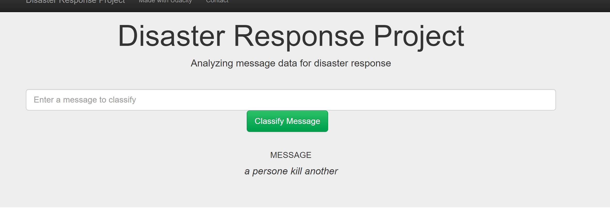
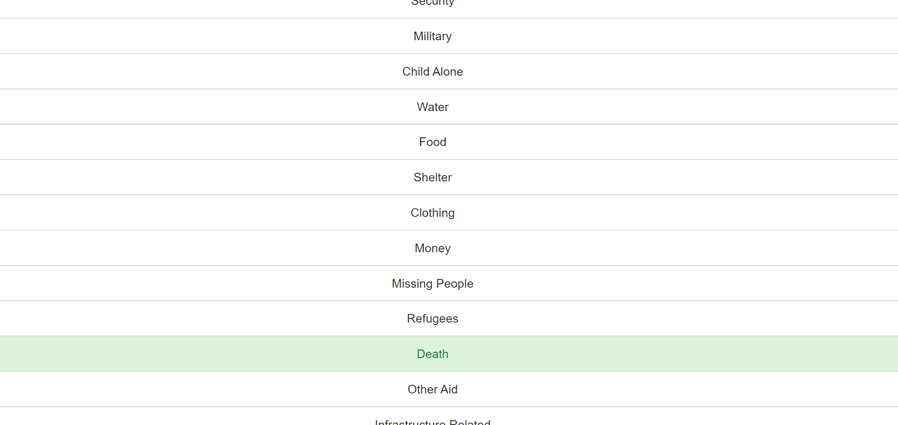

# Project: Disaster Response Pipeline

## Structure 

- [Project Overview](#overview)
- [Project Components](#components)
  - [ETL Pipeline](#etl_pipeline)
  - [ML Pipeline](#ml_pipeline)
  - [Flask Web App](#flask)
- [Running](#run)
  - [Data Cleaning](#cleaning)
  - [Training Classifier](#training)
  - [Starting the Web App](#starting)
- [Conclusion](#conclusion)


***

<a id='overview'></a>

## 1. presentation of the project 


in this project I will use the data provided on <a href="https://www.figure-eight.com/" target="_blank">Figure Eight</a>
to classifie messages on 36 classes

## 2. Structure of the project 


<a id='etl_pipeline'></a>

### 2.1. ETL Pipeline

File _data/process_data.py_ contains data cleaning pipeline that:

- Loads the `messages` and `categories` dataset
- Merges the two datasets
- Cleans the data
- Stores it in a **SQLite database**

<a id='ml_pipeline'></a>

### 2.2. ML Pipeline

File _models/train_classifier.py_ contains machine learning pipeline that:

- Loads data from the **SQLite database**
- Splits the data into training and testing sets
- Builds a text processing and machine learning pipeline **Tokenize**
- Trains and tunes a model using GridSearchCV
- Outputs result on the test set
- Exports the final model as a pickle file **model.pkl**

<a id='flask'></a>

### 2.3. Flask Web App

<a id='eg'></a>

Running [this command](#com) **from app directory** will start the web app where users can enter their query, i.e., a request message sent during a natural disaster, e.g. _"Please, we need tents and water. We are in Silo, Thank you!"_.




What the app will do is that it will classify the text message into categories so that appropriate relief agency can be reached out for help.




<a id='run'></a>

## 3. Running

There are three steps to get up and runnning with the web app if you want to start from ETL process.

<a id='cleaning'></a>


**Go to the project directory** and the run the following command:

```bat
python data/process_data.py data/disaster_messages.csv data/disaster_categories.csv data/DisasterResponse.db
```

The first two arguments are input data and the third argument is the SQLite Database in which we want to save the cleaned data. The ETL pipeline is in _process_data.py_.

_DisasterResponse.db_ already exists in _data_ folder but the above command will still run and replace the file with same information. 

**_Screenshot 3_**


<a id='training'></a>

### 3.2. Training Classifier

After the data cleaning process, run this command **from the project directory**:

```bat
python models/train_classifier.py data/DisasterResponse.db models/classifier.pkl
```

This will use cleaned data to train the model, improve the model with grid search and saved the model to a pickle file (_classifer.pkl_).

_classifier.pkl_ already exists but the above command will still run and replace the file will same information.


It took me around **4 minutes** to train the classifier with grid search.

When the models is saved, it will look something like this.

<a id='acc'></a>


<a id='starting'></a>

### 3.3. Starting the web app

Now that we have cleaned the data and trained our model. Now it's time to see the prediction in a user friendly way.

**Go the app directory** and run the following command:

<a id='com'></a>

```bat
python run.py
```

This will start the web app and will direct you to a URL where you can enter messages and get classification results for it.


<a id='conclusion'></a>

## 4. Conclusion


As we can see the data is highly imbalanced. Though the accuracy metric is [high](#acc) (you will see the exact value after the model is trained by grid search, it is ~0.94), it has a poor value for recall (~0.6). So, take appropriate measures when using this model for decision-making process at a larger scale or in a production environment.
